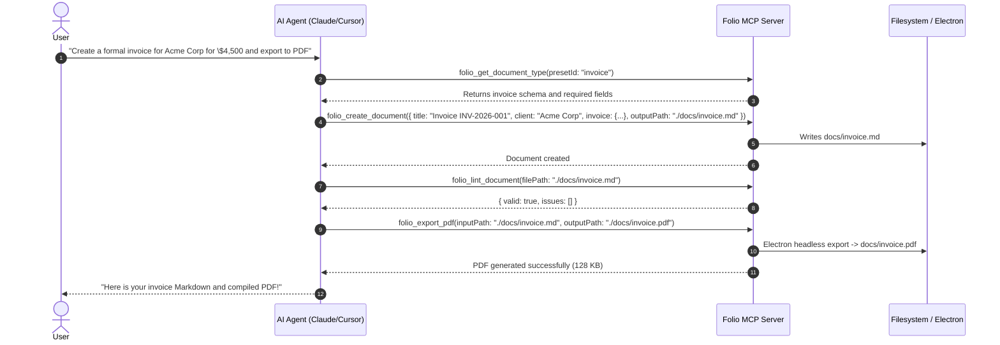

# Model Context Protocol (MCP) Integration

Folio includes a native **Model Context Protocol (MCP)** server that allows AI agents (such as Claude Desktop, Cursor, Google Antigravity, Cline, Windsurf, and custom agent pipelines) to inspect document types, generate branded Markdown documents, customize themes and metadata, lint layouts, and export pixel-perfect PDFs end-to-end.

---

## 1. Quickstart: How to Connect

The Folio MCP server communicates over standard input/output (`stdio`), the standard protocol for local desktop agents.

## 1. Quickstart: How to Connect

Folio supports running the MCP server directly from the installed macOS application using the native `--mcp` flag. This requires **zero Git cloning and zero Node.js dependencies**.

### Recommended: Installed Folio Desktop App (`--mcp`)

If you have Folio installed in `/Applications/Folio.app`, point your client directly to the Folio binary with `--mcp`:

```json
{
  "mcpServers": {
    "folio": {
      "command": "/Applications/Folio.app/Contents/MacOS/Folio",
      "args": ["--mcp"]
    }
  }
}
```

> **Pro Tip: System-wide `folio` CLI Shortcut**
> Symlink Folio into your system PATH:
> ```bash
> sudo ln -sf /Applications/Folio.app/Contents/MacOS/Folio /usr/local/bin/folio
> ```
> Then configure any AI client with simply:
> ```json
> {
>   "mcpServers": {
>     "folio": {
>       "command": "folio",
>       "args": ["--mcp"]
>     }
>   }
> }
> ```

---

### Alternative: Local Repository Development

If you are developing inside the Folio repository clone:

```json
{
  "mcpServers": {
    "folio": {
      "command": "pnpm",
      "args": ["mcp"]
    }
  }
}
```

---

### Client Configuration Locations

- **Claude Desktop:** `~/Library/Application Support/Claude/claude_desktop_config.json`
- **Cursor:** `.cursor/mcp.json` or **Cursor Settings > Features > MCP**
- **Google Antigravity:** `~/.gemini/config/mcp_config.json`
- **VS Code (Cline / Roo Code):** `cline_mcp_settings.json`
- **Windsurf:** `~/.codeium/windsurf/mcp_config.json`

Restart your AI client, and you will see Folio's 7 tools available immediately.

---

## 2. Distribution Options

Folio's MCP server can be distributed in three ways:

| Distribution Channel | Target Audience | How User Connects | Requirements |
| :--- | :--- | :--- | :--- |
| **1. Bundled Folio macOS App (`--mcp`)** | Any user with the Folio app installed | `"/Applications/Folio.app/Contents/MacOS/Folio", "--mcp"` or `folio --mcp` | **Zero Node.js dependency** (uses bundled Electron runtime) |
| **2. Standalone CLI (`folio`)** | Command-line power users & scripts | `folio --mcp` | Folio in PATH |
| **3. Local Workspace / Dev** | Folio contributors | `pnpm mcp` | Node.js + pnpm + local clone |

---

## 3. Available Tools Reference

The Folio MCP server exposes 7 tools designed for autonomous agent workflows:

### 1. `folio_list_document_types`
Lists all available document layouts and presets (both built-in and custom workspace presets saved in `.folio/presets/`).
- **Inputs:** None.
- **Returns:** JSON array with `id`, `name`, `description`, `baseLayout`, `defaultTheme`, `defaultLang`, `kicker`, and `isCustom`.

### 2. `folio_get_document_type`
Fetches complete details for a specific document preset, including schema fields, required metadata, frontmatter defaults, and starter template body.
- **Inputs:**
  - `presetId` (string, required): e.g. `'invoice'`, `'report'`, `'contract'`, `'simple'`, `'cv'`, `'whitepaper'`, `'tech-spec'`.
- **Returns:** Full schema definition and starter Markdown.

### 3. `folio_register_document_type`
Registers a new reusable document type and persists it to `.folio/presets/<id>.json`.
- **Inputs:**
  - `id` (string): Unique identifier (e.g. `'grant-proposal'`).
  - `name` (string): Human-readable name.
  - `description` (string): Explanation of when to use this document type.
  - `baseLayout` (`'cover-report'` \| `'simple'` \| `'invoice'`): Base layout architecture.
  - `defaultTheme` (string, optional): Default color theme (e.g. `'editorial'`, `'modern'`, `'warm'`, `'contrast'`).
  - `defaultLang` (string, optional): Default language code (`'en'`, `'es'`).
  - `kicker` (string, optional): Default category kicker.
  - `customFrontMatter` (object, optional): Pre-filled frontmatter keys.
  - `templateBody` (string, optional): Starter markdown body with headings and placeholders.
- **Returns:** Confirmation and the file path where the preset was saved.

### 4. `folio_create_document`
Generates a complete, ready-to-render Folio Markdown document from scratch.
- **Inputs:**
  - `presetId` (string, optional): Preset to base the document on.
  - `title` (string, required): Document title.
  - `baseLayout` (`'cover-report'` \| `'simple'` \| `'invoice'`, optional): Defaults to preset's base layout.
  - `theme` (string, optional): Theme override.
  - `lang` (string, optional): Language code.
  - `kicker` (string, optional): Category kicker.
  - `client` / `preparedFor` / `preparedBy` / `date` / `validUntil` / `documentId`: Standard metadata fields.
  - `invoice`: Optional invoice structure (`number`, `issueDate`, `dueDate`, `currency`, `items`, `notes`, etc.).
  - `headerLeft` / `headerRight` / `footerLeft` / `footerRight`: Running headers and footers for simple documents.
  - `bodyMarkdown` (string, optional): Body content. If omitted, uses preset template.
  - `outputPath` (string, optional): If provided, writes the document directly to disk.
- **Returns:** Full generated Markdown document text and write confirmation.

### 5. `folio_customize_document`
Modifies an existing Markdown document's frontmatter or replaces its body while preserving formatting and frontmatter comments.
- **Inputs:**
  - `filePath` (string, optional): Path to existing `.md` file.
  - `markdownContent` (string, optional): Existing markdown string (if not reading from disk).
  - `frontMatterUpdates` (object, optional): Partial key-value pairs to update in YAML frontmatter.
  - `newBody` (string, optional): Replacement Markdown body.
  - `appendBody` (string, optional): Markdown to append to the existing body.
  - `outputPath` (string, optional): File path to save updated content.
- **Returns:** Updated Markdown content and write confirmation.

### 6. `folio_lint_document`
Checks Markdown document for syntax issues, broken LaTeX equations, malformed Mermaid diagrams, missing frontmatter keys, or invalid layouts.
- **Inputs:**
  - `filePath` (string, optional): Path to `.md` file to lint.
  - `markdownContent` (string, optional): Markdown string to lint.
- **Returns:** Validation result with `valid: boolean` and detailed list of errors and warnings with line numbers and suggestions.

### 7. `folio_export_pdf`
Compiles a Folio Markdown document into an A4 PDF using the headless Electron renderer (Paged.js, KaTeX, Mermaid, color themes, running headers/footers).
- **Inputs:**
  - `inputPath` (string, optional): Path to input `.md` file.
  - `markdownContent` (string, optional): Markdown string to render directly.
  - `outputPath` (string, required): Destination path for the `.pdf` file.
- **Returns:** PDF export status, file size, and output path.

---

## 4. Example Agent Workflow

Here is how an AI agent uses Folio MCP tools end-to-end:



---

## 5. Built-in vs. Custom Presets

Folio ships with 9 built-in presets:
- **`report`**: Formal corporate report / SOW with cover page, metadata table, and page numbering.
- **`invoice`**: Professional commercial invoice with line items, tax, balances, due date, and payment instructions.
- **`simple`**: Clean, non-cover Markdown document with customizable running headers and footers.
- **`cv`**: Professional resume / curriculum vitae format.
- **`whitepaper`**: Academic / scientific paper format with KaTeX equation typography.
- **`tech-spec`**: Technical architecture specification with Mermaid diagram defaults.
- **`contract`**: Legal agreement / contract layout with signature blocks.
- **`meeting-notes`**: Lightweight structured meeting minutes.
- **`receipt`**: Compact receipt format.

Custom presets created via `folio_register_document_type` are saved to `.folio/presets/<id>.json` in your workspace and become automatically available to all future agent sessions.
