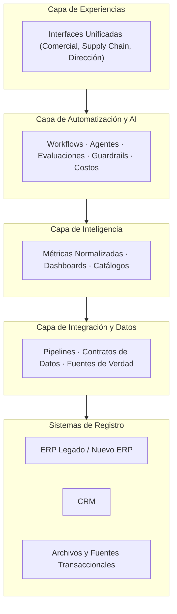
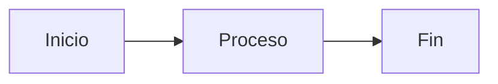
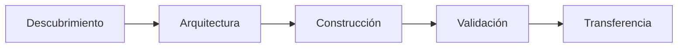

\pagebreak

# Portada del Cuerpo

Primer párrafo después de un salto de página con barra invertida.

> **Cita destacada:** este bloque verifica el estilo de cita y que no se parta entre páginas.

<!-- pagebreak -->

## 01 — Encabezado que Inicia con Dígitos

Este encabezado produce un ancla que no debe comenzar con un número, o Paged.js
falla al resolver las referencias del índice.

<!-- page-break -->

## 02 — Saltos y Tablas

Párrafo de entrada que debe permanecer en la misma página que su tabla.

| Columna | Contenido multilínea | Nota |
| :--- | :--- | :--- |
| **Fila A** | Primera línea.<br>Segunda línea tras un salto explícito.<br>Tercera línea. | Verifica que `<br>` no aparezca como texto literal. |
| **Fila B** | Valor simple. | Texto con `código en línea` y *énfasis*. |

{.pagebreak}

## 03 — Diagrama Alto

El siguiente diagrama es más alto que una página sin escalado; verifica que se
ajuste completo y que no se parta.



## 04 — Diagrama Corto

Este diagrama pide el ancho completo de la caja de texto.



<!-- landscape -->

### Sección Apaisada

Esta sección ocupa una página apaisada; el diagrama debe ajustarse al ancho
mayor y a la altura menor.



<!-- /landscape -->

## 05 — Diagrama Inválido

El siguiente bloque tiene sintaxis inválida a propósito: debe degradar a un
mensaje de error sin interrumpir la paginación.

```mermaid
flowchart LR
  A[[[["roto
```

## 06 — Bloque de Código

```ts
const total = items.reduce((sum, item) => sum + item.amount, 0)
```

## 07 — Cierre

### Subsección de Tercer Nivel

Último párrafo del documento de prueba, con un [enlace a una sección](#section-01-encabezado-que-inicia-con-digitos).

Párrafo seguido de un salto embebido en el flujo de texto.
\pagebreak
Párrafo posterior al salto embebido.
